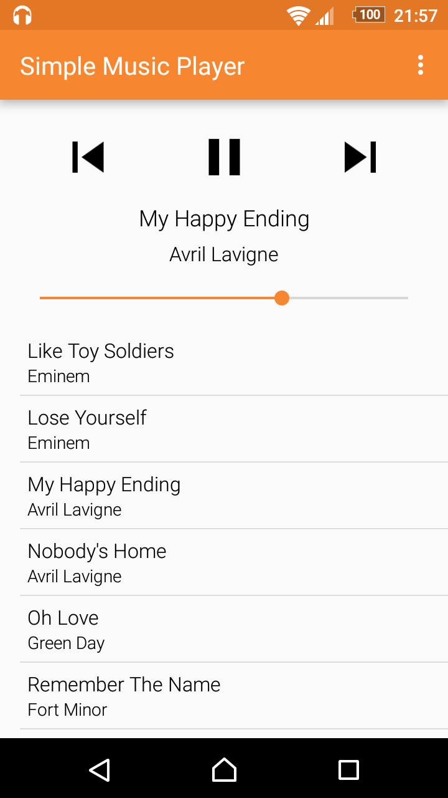
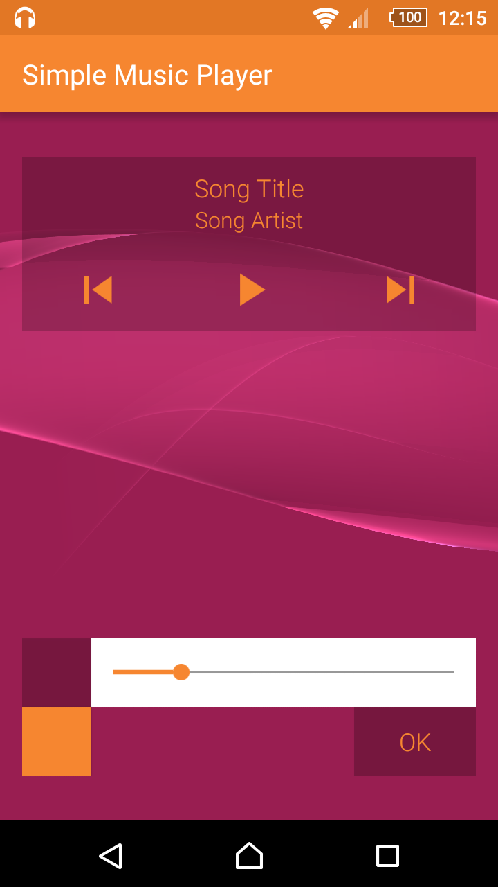
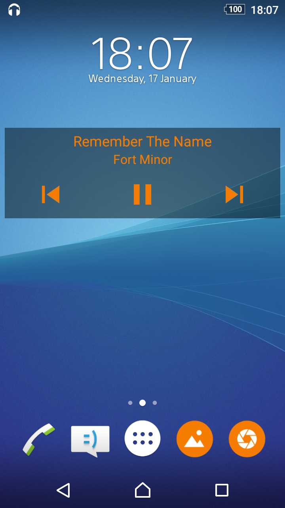

# Simple Music Player

A music player with the basic functions and a customizable widget.

It takes every song from your device that is more than 20 seconds long, without the ability to filter by artist etc. The app can be used for renaming the song title, artist or filename. You can control it easily both from the status bar notification or with hardware button on your headset.

It contains a customizable widget for your home screen, where you can change the font color, or the alpha and the color of the background. The widget can be of size 4x1 or 4x2.

License
-------
    Copyright 2016 SimpleMobileTools
    
    Licensed under the Apache License, Version 2.0 (the "License");
    you may not use this file except in compliance with the License.
    You may obtain a copy of the License at
    
       http://www.apache.org/licenses/LICENSE-2.0
    
    Unless required by applicable law or agreed to in writing, software
    distributed under the License is distributed on an "AS IS" BASIS,
    WITHOUT WARRANTIES OR CONDITIONS OF ANY KIND, either express or implied.
    See the License for the specific language governing permissions and
    limitations under the License.
