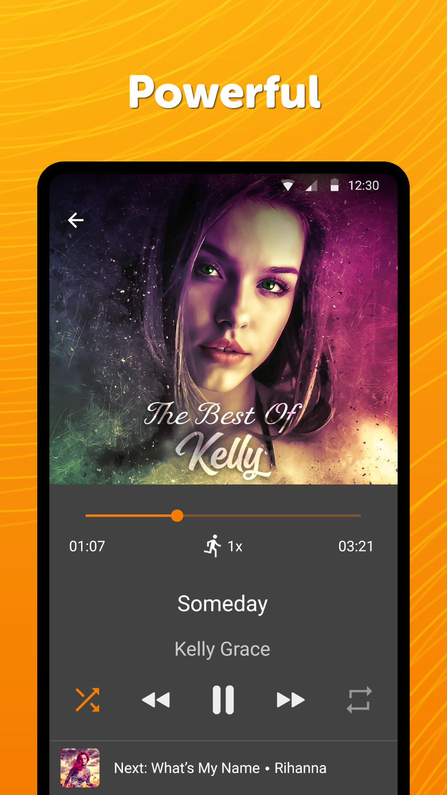
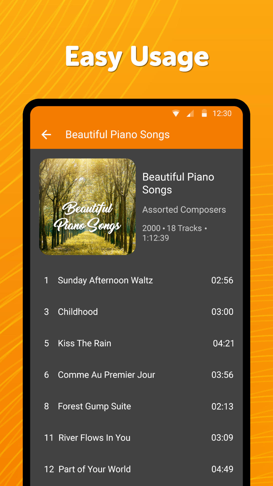

# Simple Music Player

A simple music player easily controllable from the status bar, home screen widget or by hardware buttons on your headset. It provides all expected functions like sorting in various ways as well as changing the Equalizer.  Listen to your favorite mp3, other songs or podcasts with this free beautiful music player.

It offers exclusive extras like Search and showing Album Art, a sleep timer and many other settings. This elegant music player allows you creating and managing handy playlists as you desire.

Playlists are fully supported. You can add either individual files, or whole folders. If you won\'t like a file, you can either just remove it from a playlist, or delete the actual file altogether.

Comes with a handy sleep timer so that you can reliably delay the time of the app shutting down.

Supports both shuffle and repeating a particular song, as well as skipping and fast forwarding.

Available in many different languages and offers multiple different equalizers.

Easily check a file properties like the size, duration, last modified etc.

Modify file EXIF data like the song title and artist.

Quickly share files with your friends on social networks, emails, or anywhere you would like.

This stylish music player contains a widget with customizable text color, alpha and the color of the background for easy access and control.

It properly handles third party intents too for playing individual audio files so it can help at setting ringtones too.

It comes with material design and dark theme by default, provides great user experience for easy usage. The lack of internet access gives you more privacy, security and stability than other apps.

Contains no ads or unnecessary permissions. It is fully opensource and provides customizable colors.

Check out the full suite of Simple Tools here:  
https://www.simplemobiletools.com

Facebook:  
https://www.facebook.com/simplemobiletools

Reddit:  
https://www.reddit.com/r/SimpleMobileTools

