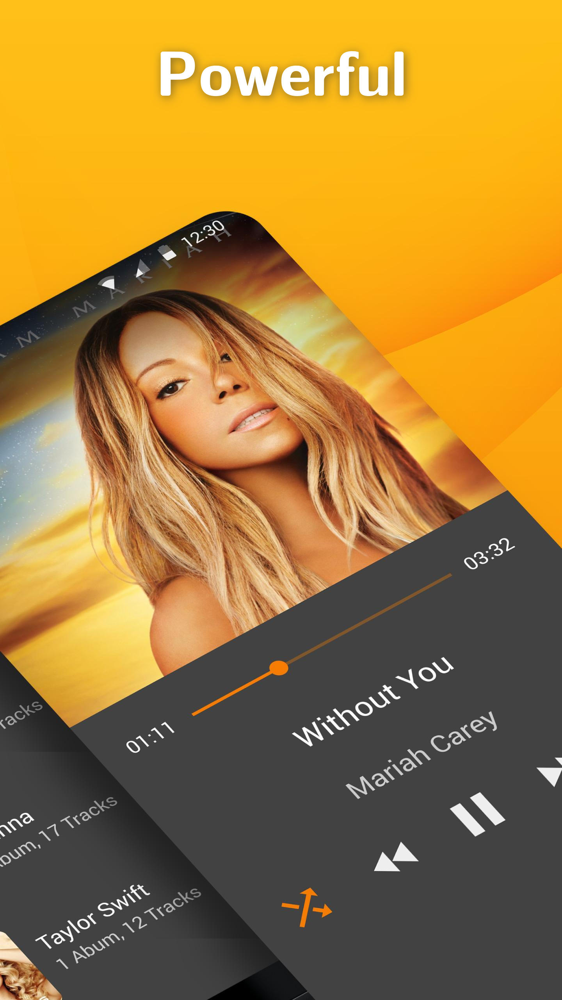
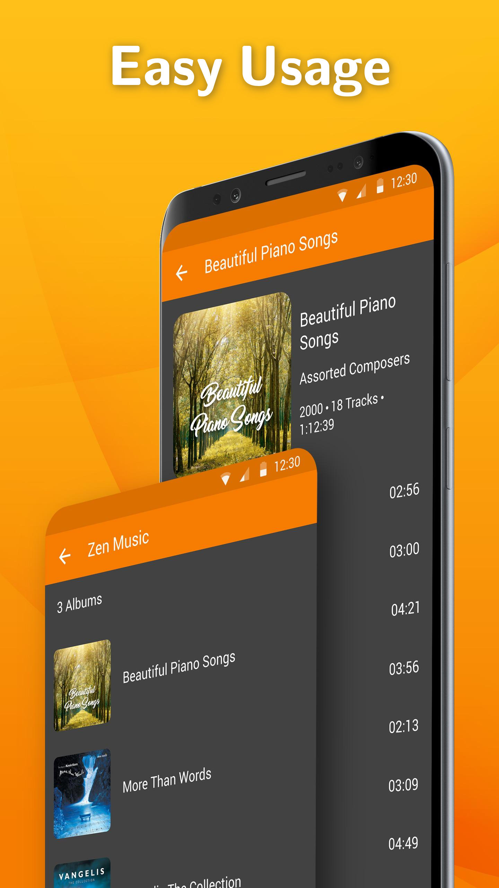

# Simple Music Player

A clean music player with a customizable widget.

A music player easily controllable from the status bar, home screen widget or by hardware buttons on your headset. You can sort the tracks by the Title or Artist, as well as change the Equalizer. Does not yet support filtering by artist or album, stay tuned!

It contains a widget with customizable text color, alpha and the color of the background.

Contains no ads or unnecessary permissions. It is fully opensource, provides customizable colors.

This app is just one piece of a bigger series of apps. You can find the rest of them at https://www.simplemobiletools.com

